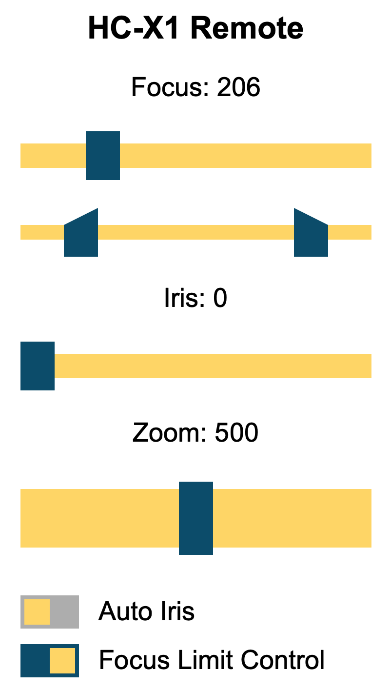

# PanCamRemote_RX

An ESP32 based remote control receiver for the Panasonic camcorder remote interface. It contains a web interface and also provides an API to receive commands by another embedded controller over WiFi.

## HTML Interface

One solution to remote control the camera is via the web interface, hosted on the ESP32. After connecting to the AP (SSID/PW: PANCAM_REMOTE), the HTML page can be found under http://cam.local.

